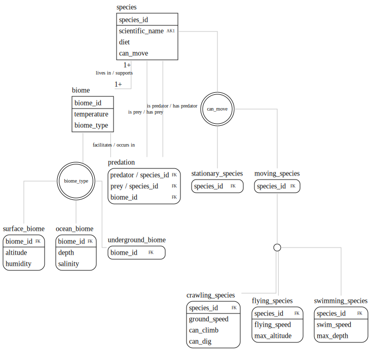

ERDMaker
========

A utility for generating [entity-relationship diagrams](https://en.wikipedia.org/wiki/Entity%E2%80%93relationship_model) for [Graphviz](https://graphviz.gitlab.io/). This is essentially a macro language over dot at this point. This is very much a work in progress.

## Grammar

### Entities

Entities are defined by a name followed by a list of attributes with modifiers. Available modifiers:

* `:pk` (primary key component)
* `:fk` (foreign key component)
    * A role name can be specified for the attribute with a slash as "new name/original name".
* `:ak#` (component of alternate key "#", where `#` is a positive integer)
* `:null` (nullable)

Example:

```
[entity1_name]
original_attribute_name

[entity2_name]
attribute1 :pk
attribute2 :ak1
attribute3/original_attribute_name :fk
```

### Relationships

There are three types of relationships: binary, exclusive subtyping, and non-exclusive subtyping.

#### Binary relationships

Two entity names with a description for their side of the relationship, and a cardinality for each side. The sides are separated by a colon. Cardinality can by "*" (zero or more), "N" for some number N, "N+" for N or more, and "N..M" for the range N to M.

Example:

```
company "patents" 1:* product "patented by"
```
(one company patents zero or more products / zero or more products are patented by each company)

#### Non-exclusive subtyping relationships

An entity can belong to one or more instances of a non-exclusive subtype. Syntax: `super :> sub1 [+ sub2]..`.

```
book :> colored_book + hardcover_book + foreign_language_book
```

#### Exclusive subtyping relationships

An entity can belong to one and only one instance of an exclusive subtype, distinguished by a discriminator. The syntax is `super =(discriminator) sub1 [+ sub2]..`.

Example:

```
book =(book_type) fiction_book + nonfiction_book
```

## Example

You can generate an example ERD with `cargo run < examples/example.erd`.

After a small bit of tweaking:

